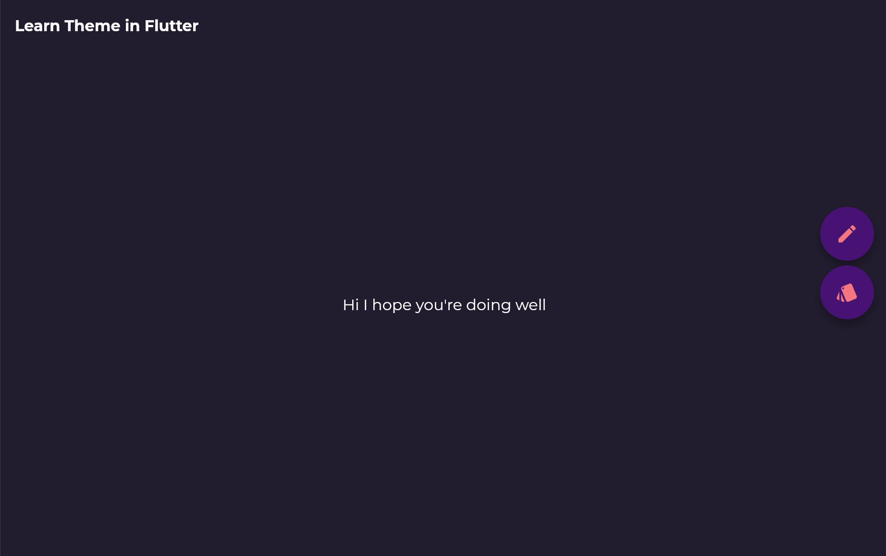
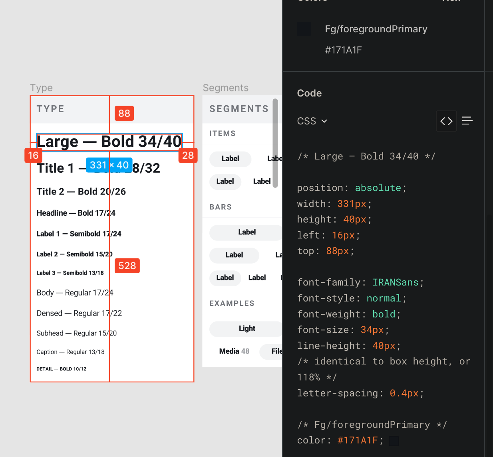

<div dir="rtl">



# آموزش تم ها در فلاتر

تم ها در فلاتر را با این پروژه یاد بگیرید. این پروژه یک [برنامه تحت وب](https://app.yazdi.dev/learn_flutter_theme) نیز دارد.


### درباره این پروژه

این پروژه دارای تم دارک و لایت و همچنین زبان فارسی و انگلیسی میباشد.

### چگونه میتوانیم تم برنامه را بر اساس مورد انتخاب شده انتخاب کنیم؟

شما میتوانید وضعیت محلی تم را با قرار دادن یک `MaterialApp` همراه با `InheritedWidget` یا هر چیز دیگر مثل `Provider` یا حتی `setState` انجام دهید. ما اینجا از روش ارث بری پیش رفتیم.

<div dir="ltr">

```dart
class _ModelBindingScope extends InheritedWidget {
  const _ModelBindingScope({
    Key? key,
    required this.modelBindingState,
    required Widget child,
  }) : super(key: key, child: child);

  final _ModelBindingState modelBindingState;

  @override
  bool updateShouldNotify(_ModelBindingScope oldWidget) => true;
}
```

</div>

و آن را به یک MaterialApp پرنت تبدیل کردیم.

<div dir="ltr">

```dart
ModelBinding(
  initialModel: OurOptions(
    themeMode: ThemeMode.system,
    textScaleFactor: systemTextScaleFactorOption,
    platform: defaultTargetPlatform,
  ),
  child: Builder(
    builder: (context) {
      return MaterialApp(
        home: const OurHomePage(),
      );
    },
  ),
);
```

</div>

### چگونه تم لایت و دارت را بسازیم؟

این کار خیلی ساده هست فقط نیاز هست یک کلاس و همراه با ویزگی هایش تعریف کنید. مثل این کار در Figma.



در اینجا دو راه وجود دارد.
کل `MaterialTheme` را بسازیم یا اینکه هر آنچه نیاز هست را با `copyWith` در `MaterialTheme` قرار دهیم. از روش دوم پیش میرویم تا هر آنچه نیاز داریم را `override` کنیم.

<div dir="ltr">

```dart
static const _lightFillColor = Colors.black;
static const _darkFillColor = Colors.white;

static final Color _lightFocusColor = Colors.black.withOpacity(0.12);
static final Color _darkFocusColor = Colors.white.withOpacity(0.12);

static final ThemeData _lightThemeData = ThemeData.light();
static final ThemeData _darkThemeData = ThemeData.dark();

static ThemeData lightThemeData(BuildContext context) =>
  themeData(_lightThemeData, context, lightColorScheme, _lightFocusColor);

static ThemeData darkThemeData(BuildContext context) =>
  themeData(_darkThemeData, context, darkColorScheme, _darkFocusColor);

static ThemeData themeData(ThemeData themeData, BuildContext context,
  ColorScheme colorScheme, Color focusColor) {
    return themeData.copyWith(
      colorScheme: colorScheme,
      textTheme: isFarsiLocale(context)
          ? _faTextTheme(themeData.textTheme, colorScheme.onPrimary)
          : _textTheme(themeData.textTheme, colorScheme.onPrimary),
    );
}
```

</div>

As you can see we passed flutter`ThemeData.light()` and `ThemeData.dark()` with our `colorScheme` and `_faTextTheme` and `_textTheme` based on the localization, and finally used `themeData.copyWith` to change what we need. 

We have two main properties that we have to customize, otherwise our theme is nothing but a MaterialTheme:

- `ColorSchema` based on light and dark theme:

<div dir="ltr">

```dart
static ColorScheme lightColorScheme = const ColorScheme.dark().copyWith(
    primary: const Color(0xFFB93C5D),
    primaryVariant: const Color(0xFF117378),
    secondary: const Color(0xFFEFF3F3),
    secondaryVariant: const Color(0xFFFAFBFB),
    background: const Color(0xFFE6EBEB),
    onSurface: const Color(0xFF241E30),
    brightness: Brightness.light,
);

static ColorScheme darkColorScheme = const ColorScheme.light().copyWith(
    primary: const Color(0xFFFF8383),
    primaryVariant: const Color(0xFF1CDEC9),
    secondary: const Color(0xFF4D1F7C),
    secondaryVariant: const Color(0xFF451B6F),
    background: const Color(0xFF241E30),
    surface: const Color(0xFF1F1929),
    onBackground: Colors.white.withOpacity(0.05),
    onSurface: _darkFillColor,
    brightness: Brightness.dark,
);
```

</div>

As you can see there are multiple colors that each one of them used for multiple purposes for flutter widgets and again we override what we need to change of flutter's light and dark `colorScheme`.

- `TextTheme` that we separated based on localization since we wanted to use a Persian font:

<div dir="ltr">

```dart
static const _regular = FontWeight.w400;
static const _medium = FontWeight.w500;
static const _semiBold = FontWeight.w600;
static const _bold = FontWeight.w700;

static TextTheme _textTheme(TextTheme textTheme, Color color) {
  return textTheme
      .copyWith(
        bodyText1: GoogleFonts.montserrat(
          fontWeight: _regular,
          fontSize: 14.0,
          textStyle: textTheme.bodyText1,
        ),
        headline4: GoogleFonts.montserrat(
          fontWeight: _bold,
          fontSize: 20.0,
          textStyle: textTheme.headline4,
        ),
        subtitle1: GoogleFonts.montserrat(
          fontWeight: _medium,
          fontSize: 16.0,
          textStyle: textTheme.subtitle1,
        ),
        caption: GoogleFonts.oswald(
          fontWeight: _semiBold,
          fontSize: 16.0,
          textStyle: textTheme.caption,
        ),
        button: GoogleFonts.montserrat(
          fontWeight: _semiBold,
          fontSize: 14.0,
          textStyle: textTheme.button,
        ),
      )
      .apply(bodyColor: color);
}
static TextTheme _faTextTheme(TextTheme textTheme, Color color) {
  return textTheme
      .copyWith(
        bodyText1: textTheme.bodyText1!.copyWith(
          fontWeight: _regular,
          fontSize: 14.0,
          fontFamily: 'IRANSans-Regular',
        ),
        headline4: textTheme.headline4!.copyWith(
          fontWeight: _bold,
          fontSize: 20.0,
          fontFamily: 'IRANSans-Bold',
        ),
        subtitle1: textTheme.subtitle1!.copyWith(
          fontWeight: _medium,
          fontSize: 16.0,
          fontFamily: 'IRANSans-Medium',
        ),
        caption: textTheme.caption!.copyWith(
          fontWeight: _semiBold,
          fontSize: 16.0,
          fontFamily: 'IRANSans-SemiBold',
        ),
        button: textTheme.button!.copyWith(
          fontWeight: _semiBold,
          fontSize: 14.0,
          fontFamily: 'IRANSans-Medium',
        ),
      )
      .apply(bodyColor: color);
}
```

</div>

This is the place where we need to import our custom fonts. We used a `GoogleFont` package for our English text and a Persian font for our Persian text. Just don't forget to put your font in the `pubspec.yaml`:

<div dir="ltr">

```yaml
assets:
  - fonts/google_fonts/
fonts:
  - family: IRANSans-Medium
    fonts:
      - asset: fonts/IRANSans-Medium.ttf
  - family: IRANSans-Regular
    fonts:
      - asset: fonts/IRANSans-Regular.ttf
  - family: IRANSans-SemiBold
    fonts:
      - asset: fonts/IRANSans-SemiBold.ttf
  - family: IRANSans-Bold
    fonts:
      - asset: fonts/IRANSans-Bold.ttf
```

</div>

and don't forget if you have multiple `FontWeight`, you should also add the other big fonts like `IRANSans-SemiBold` and `IRANSans-Bold`

Everything else should be defined by your requirements in Figma like

<div dir="ltr">

```dart
themeData.copyWith(
  appBarTheme: AppBarTheme(
    textTheme: isFarsiLocale(context)
        ? _faTextTheme(themeData.textTheme, colorScheme.onPrimary)
        : _textTheme(themeData.textTheme, colorScheme.onPrimary),
    color: colorScheme.background,
    elevation: 0,
    iconTheme: IconThemeData(color: colorScheme.primary),
    brightness: colorScheme.brightness,
  ),
  bottomAppBarTheme: BottomAppBarTheme(
    color: colorScheme.primary,
  ),
  buttonTheme: ButtonThemeData(
    textTheme: ButtonTextTheme.primary,
    colorScheme: colorScheme,
  ),
  floatingActionButtonTheme: themeData.floatingActionButtonTheme
      .copyWith(foregroundColor: colorScheme.primary),
  iconTheme: IconThemeData(color: colorScheme.onPrimary),
  toggleableActiveColor: colorScheme.primary,
  indicatorColor: colorScheme.onPrimary,
  primaryColor: colorScheme.primary,
  scaffoldBackgroundColor: colorScheme.background,
  highlightColor: Colors.transparent,
  accentColor: colorScheme.primary,
  snackBarTheme: SnackBarThemeData(
    behavior: SnackBarBehavior.floating,
    backgroundColor: Color.alphaBlend(
      _lightFillColor.withOpacity(0.80),
      _darkFillColor,
    ),
    contentTextStyle: isFarsiLocale(context)
        ? _faTextTheme(themeData.textTheme, colorScheme.onPrimary)
            .subtitle1!
            .apply(color: _darkFillColor)
        : _textTheme(themeData.textTheme, colorScheme.onPrimary)
            .subtitle1!
            .apply(color: _darkFillColor),
  ),
);
```

</div>

### چگونه میتوانیم درباره محلی سازی تم بدانیم؟

Here we have a helper method:

<div dir="ltr">

```dart
bool isFarsiLocale(BuildContext context) {
  return (OurOptions.of(context)!.locale?.languageCode ?? false) == 'fa';
}
```

</div>

If you pass a `context` to the theme, you can check localization based on an inherited widget that we created at the first step  It could be a `provider` or a `bloc` but you definitely need a `context` to access your selected localization (Or maybe you're using `getX` which I haven't tried :D).

Then all you have to do is a simple if else:

<div dir="ltr">

```dart
themeData.copyWith(
  colorScheme: colorScheme,
  textTheme: isFarsiLocale(context)
      ? _faTextTheme(themeData.textTheme, colorScheme.onPrimary)
      : _textTheme(themeData.textTheme, colorScheme.onPrimary),
);
```

</div>

### آیا راهی برای تغییر تم در ویجت و چاید ها وجود دارد؟

Yes, just wrap your widget by a `Theme` widget and you can define everything again:

<div dir="ltr">

```dart
Theme(
    data: ThemeData(backgroundColor: Colors.red),
    child: OurChild(),
),
```

</div>

You could also again use your previous `ThemeData` by using `Theme.of(context)` and change it what you need by using `Theme.of(context).copyWith()`. Flutter always looks for your closet `ThemeData` that's why it returned the one you define in you `MaterialApp` not the flutter's `ThemeData`.

You can always use style or theme properties like `ButtonTheme` widget and flutter apply them first, for example if we want to change one text's style:

<div dir="ltr">

```dart
Text(
  OurLocalizations.of(context)!.ourText,
  style: Theme.of(context).textTheme.headline1,
)
```

</div>

### سخن آخر

In this project, I tried to explain theming as simply as I could. The flutter theme is simple as well as powerful. So clone this project and try to customize it with new ideas and don't forget the PRs are most welcomed.
By the way, it is so much better to read flutter documentation: [Use themes to share colors and font styles](https://docs.flutter.dev/cookbook/design/themes), [Theme class API](https://api.flutter.dev/flutter/material/Theme-class.html) and [ThemeData class API](https://api.flutter.dev/flutter/material/ThemeData-class.html)

<!-- Thanks for your support by starring this repository, sorry I made this explanation in English, believe me, I tried but it's way hard to say all this stuff in Persian, but who knows maybe a nice guy will make a PR containing a `README-fa.md`. -->

</div>